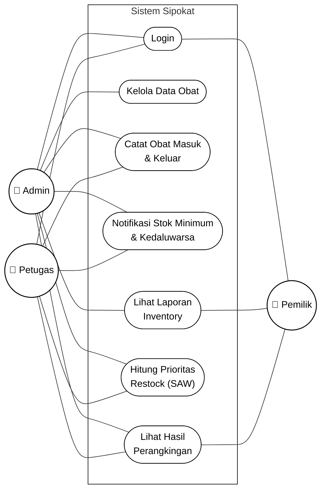
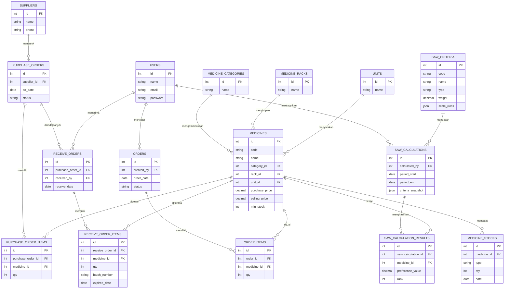
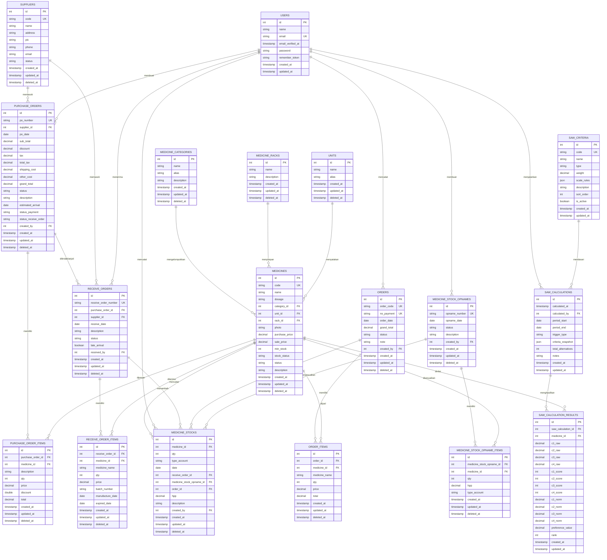

# Rencana Diagram UML — Sipokat

Sistem: **Sipokat — Sistem Inventory Obat + SPK SAW (Apotek Anugrah Husada)**

Dokumen ini memuat **kode Mermaid** untuk setiap diagram yang dibutuhkan pada Bab III, dengan penomoran gambar yang sama seperti pada `draft_isi_ta.md`. Class Diagram tidak digunakan karena struktur data diwakili ERD.

**Cara pakai:** render di VS Code (ekstensi Markdown Preview Mermaid) atau di [mermaid.live](https://mermaid.live), lalu ekspor PNG/SVG dan sisipkan ke naskah pada penanda `【Sisipkan gambar di sini】`.

## Aktor

| Aktor | Peran | Ringkasan hak akses |
|-------|-------|---------------------|
| **Admin** | Apoteker Penanggung Jawab | Master data, konfigurasi kriteria & bobot SAW, jalankan perhitungan SAW, laporan, manajemen user |
| **Petugas** | Staf Gudang | Obat masuk (Receive Order), obat keluar (penjualan), stok opname, lihat stok |
| **Pemilik** | Manajer / Pemilik | Dashboard, laporan rekap, hasil perangkingan SAW (umumnya read-only) |

## Daftar gambar

| Gambar | Judul | Prioritas |
|---|---|---|
| 3.2 | Use Case Diagram Sistem | Wajib |
| 3.3 | Activity Diagram Login (F-01) | Wajib |
| 3.4 | Activity Diagram Pencatatan Obat Masuk (F-03) | Wajib |
| 3.5 | Activity Diagram Pencatatan Obat Keluar (F-03) | Wajib |
| 3.6 | Activity Diagram Perhitungan Prioritas Restock (F-06/F-07) | **Wajib (inti)** |
| 3.7 | Entity Relationship Diagram (ERD) | Wajib |

---

## Gambar 3.2 — Use Case Diagram Sistem

Use case mengikuti persis 7 kebutuhan fungsional Tabel 3.3 (F-01–F-07) di `draft_isi_ta.md` — tidak ditambah use case lain di luar yang tertulis di naskah. Pemetaan aktor mengikuti kolom "Kebutuhan Fitur dan Fungsi" pada Tabel 3.2.

| Kode | Use Case | Admin | Petugas | Pemilik |
|---|----------|:---:|:---:|:---:|
| F-01 | Login | ✅ | ✅ | ✅ |
| F-02 | Kelola Data Obat | ✅ | | |
| F-03 | Catat Obat Masuk & Keluar | ✅ | ✅ | |
| F-04 | Notifikasi Stok Minimum & Kedaluwarsa | ✅ | ✅ | |
| F-05 | Lihat Laporan Inventory | ✅ | | ✅ |
| F-06 | Hitung Prioritas Restock (SAW) | ✅ | ✅ | |
| F-07 | Lihat Hasil Perangkingan | ✅ | ✅ | ✅ |

> **Catatan render:** mengikuti gaya diagram use case klasik (aktor di kiri/kanan, use case dalam satu kolom vertikal di dalam kotak subsistem). Semua use case sengaja **tidak** dihubungkan satu sama lain — hanya diberi edge dari/ke aktor — supaya Mermaid menempatkan mereka pada rank yang sama (satu kolom) dan menyusunnya vertikal secara otomatis. Jangan tambahkan link berantai antar use case (termasuk invisible link `~~~`): pada `flowchart LR`, rank berjalan horizontal, jadi link semacam itu justru mendorong tiap node ke kolom berikutnya alih-alih menyusunnya vertikal.

---

## Gambar 3.3 — Activity Diagram Login (F-01)

```mermaid
---
config:
  layout: fixed
---
flowchart TB
 subgraph s1[" "]
        A((" "))
        B["Akses Website"]
        C["Masukkan Username dan Password"]
        D{"Verifikasi"}
        E["Masuk Ke Dashboard"]
        F((" "))
        G["Notifikasi"]
  end
    A --> B
    B --> C
    C L_C_D_0@--> D
    E --> F
    D L_D_G_0@-- Tidak --> G
    G --> C
    D L_D_E_0@-- Ya --> E

    style A fill:#000000
    style D fill:#FFD600
    style F fill:#000000

    L_C_D_0@{ curve: linear } 
    L_D_G_0@{ curve: linear } 
    L_D_E_0@{ curve: linear }
```

---

## Gambar 3.4 — Activity Diagram Pencatatan Obat Masuk (F-03)

```mermaid
---
config:
  layout: fixed
---
flowchart TB
 subgraph s1[" "]
        A((" "))
        B["Membuka Menu Obat Masuk"]
        C["Memilih Supplier dan Data Pesanan"]
        D["Memasukkan Obat dan Jumlah yang Diterima"]
        E["Memasukkan Nomor Batch, Tanggal Produksi, dan Tanggal Kedaluwarsa"]
        F{"Data Lengkap dan Valid?"}
        G["Menampilkan Pesan Kesalahan"]
        H["Menyimpan Transaksi Obat Masuk"]
        I["Menambah Stok Obat"]
        J["Memperbarui Status Stok Obat"]
        K((" "))
  end
    A --> B
    B --> C
    C --> D
    D --> E
    E L_E_F_0@--> F
    F L_F_G_0@-- Tidak --> G
    G --> D
    F L_F_H_0@-- Ya --> H
    H --> I
    I --> J
    J --> K

    style A fill:#000000
    style F fill:#FFD600
    style K fill:#000000

    L_E_F_0@{ curve: linear }
    L_F_G_0@{ curve: linear }
    L_F_H_0@{ curve: linear }
```

---

## Gambar 3.5 — Activity Diagram Pencatatan Obat Keluar (F-03)

```mermaid
---
config:
  layout: fixed
---
flowchart TB
 subgraph s1[" "]
        A((" "))
        B["Membuka Menu Penjualan"]
        C["Memilih Obat dan Memasukkan Jumlah"]
        D["Memeriksa Ketersediaan Stok"]
        E{"Jumlah Kurang dari atau Sama dengan Stok?"}
        F["Menampilkan Pesan Stok Tidak Mencukupi"]
        G["Menyimpan Transaksi Obat Keluar"]
        H["Mengurangi Stok Obat"]
        I["Memperbarui Status Stok Obat"]
        J((" "))
  end
    A --> B
    B --> C
    C --> D
    D L_D_E_0@--> E
    E L_E_F_0@-- Tidak --> F
    F --> C
    E L_E_G_0@-- Ya --> G
    G --> H
    H --> I
    I --> J

    style A fill:#000000
    style E fill:#FFD600
    style J fill:#000000

    L_D_E_0@{ curve: linear }
    L_E_F_0@{ curve: linear }
    L_E_G_0@{ curve: linear }
```

---

## Gambar 3.6 — Activity Diagram Perhitungan Prioritas Restock (SAW) (F-06/F-07) **(inti)**

```mermaid
---
config:
  layout: fixed
---
flowchart TB
 subgraph s1[" "]
        A((" "))
        B["Membuka Halaman Hitung Prioritas Restock"]
        C["Menentukan Periode Perhitungan"]
        D["Mengambil Kriteria dan Bobot yang Aktif"]
        E{"Total Bobot Sama dengan 1?"}
        F["Menampilkan Peringatan Bobot Tidak Valid"]
        G["Mengambil Data Obat Aktif"]
        H["Menghitung Nilai Mentah Kriteria C1 sampai C4"]
        I["Mengonversi Nilai Mentah ke Skala 1 sampai 5"]
        J["Normalisasi Matriks (Cost: Min/X, Benefit: X/Max)"]
        K["Menghitung Nilai Preferensi Vi = ΣWj × Rij"]
        L["Mengurutkan Obat Berdasarkan Vi Menurun"]
        M["Menyimpan Hasil Perhitungan"]
        N["Menampilkan Tabel Perangkingan Prioritas Restock"]
        Z((" "))
  end
    A --> B
    B --> C
    C --> D
    D --> E
    E L_E_F_0@-- Tidak --> F
    F --> Z
    E L_E_G_0@-- Ya --> G
    G --> H
    H --> I
    I --> J
    J --> K
    K --> L
    L --> M
    M --> N
    N --> Z

    style A fill:#000000
    style E fill:#FFD600
    style Z fill:#000000
    style H stroke-width:3px
    style I stroke-width:3px
    style J stroke-width:3px
    style K stroke-width:3px
    style L stroke-width:3px

    L_E_F_0@{ curve: linear }
    L_E_G_0@{ curve: linear }
```

---

## Gambar 3.7 — Entity Relationship Diagram (ERD)

> **Catatan ERD:** entitas ditampilkan dengan atribut inti saja agar diagram tetap terbaca. Bila pembimbing meminta ERD lengkap, gunakan versi lengkap di bawah ini.

---

## Lampiran — ERD Lengkap *(opsional, seluruh atribut sesuai struktur tabel database)*

Dibangun langsung dari struktur migration aktual (18 tabel domain bisnis). Tabel infrastruktur framework (cache, jobs, sessions, permission/roles Spatie, notifications, settings, imports/exports) tidak diikutkan karena bukan bagian dari ERD bisnis inti. Gunakan versi ini kalau pembimbing minta detail penuh; kalau tidak, cukup pakai Gambar 3.7 di atas.

